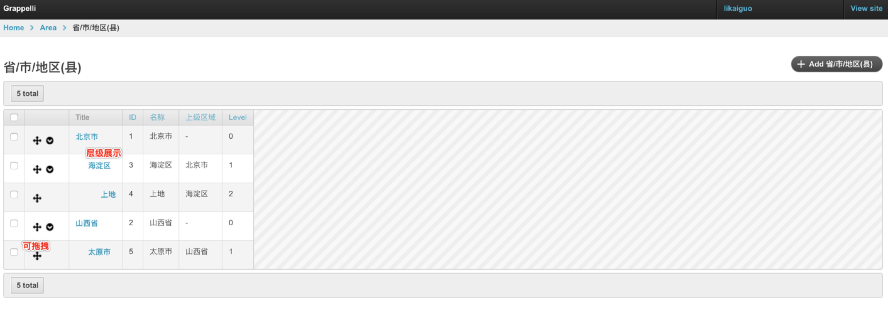

----------
使用 Django mptt 实现树形结构

* forked from https://github.com/happy-python/tree
* 加上了针对 django 2.1.x  的升级

* ```python
   python manage.py makemigrations
   python manage.py migrate
   python manage.py runserver
   ```

----------

## 使用 Django mptt 实现树形结构

项目完整介绍 [使用 django-mptt 实现树形结构](https://www.jianshu.com/p/cd5986ccba6b)
原有环境版本：
```
python 2.7.10
Django 1.8.5
django-mptt 0.8.7
```

### 高版本python和Django
```
python 3.6+
Django==2.0.5
django-mptt==0.9.0
django-mptt-admin==0.5.1
```

[django-mptt-admin](https://github.com/mbraak/django-mptt-admin)

### 运行项目(python 3.6+)
```
pip install -r requirements.txt
python manage.py makemigrations
python manage.py migrate
python manage.py runserver
```

### DRF序列化返回数据

[django-rest-framework-recursive](https://github.com/heywbj/django-rest-framework-recursive)

[Django-mptt model serialize with Django REST framework](https://stackoverflow.com/questions/31853435/django-mptt-model-serialize-with-django-rest-framework)


### 后台功能展示


